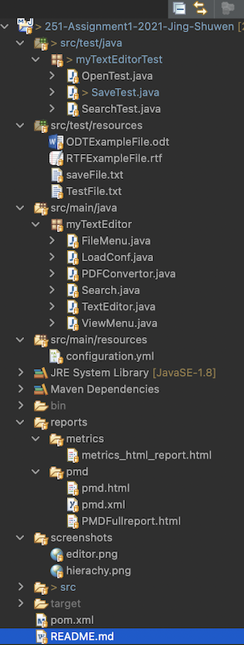
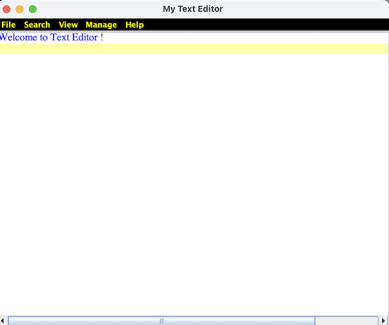

# My Text Editor Java Project

### Project folder hierachy 

### TextEditor GUI

### Main Features
* Background color applied to indecate current line.
* Able to search for text/sentence within the screen.
* open/read files (.odt; .txt; .java; .html; .py ect) of users selection in the file system. 
* Extensible syntax highlighting for multiple languages. Able to read source code files such as .java, .py, .cpp with different syntax shown in different colours. 
* save files when change happens.
* saveAs to save the file to a new path.
* open a new file as desired. if the window has new content as the user whether to save it before opening a new window.
* exit the window as desired. If the window has new content as the user whether to save it before exit.				 
* Standard functionality : Select text, Copy, Paste and Cut .
* submenu Date&Time is used to retrieve the current time and data from the OS and place it at the banner of the editor.
* AboutUs contains appreciation and authors information.
* Able to connect to the local printer in your machine with Print menu.
* File can be converted and saved to PDF format.

### Authors With commit ID.

[Shuwen 20010847](https://github.com/ssszheng)
* [Added SCPC functions #bccacc61](https://github.com/cleopatra07/251-Assignment1-2021-Jing-Shuwen/commit/bccacc610325fc20e321c1d65cbf3d96ca7ede3d)
* [Added Search and highlight function #1d61268](https://github.com/cleopatra07/251-Assignment1-2021-Jing-Shuwen/commit/1d61268324fd8a95daa1bc2797b66e29ab1c94a4)
* [Added print function #94cd4f6](https://github.com/cleopatra07/251-Assignment1-2021-Jing-Shuwen/commit/94cd4f678e5981881e82259f75ed88d6391d30bb)
* [Added PdfConverter function #7a53b29](https://github.com/cleopatra07/251-Assignment1-2021-Jing-Shuwen/commit/7a53b291d5e099876e9d4470f216462b95c30ff1)
* [Update .gitignore #368de22](https://github.com/cleopatra07/251-Assignment1-2021-Jing-Shuwen/commit/368de22d9656daf9d1afaa70d54c25e1e9915571)
* [Added unit test for search function and updated pom.xml #6358771](https://github.com/cleopatra07/251-Assignment1-2021-Jing-Shuwen/commit/63587718631c074ba8f127bea94db683ea827d17)
* [Added syntax coloring feature #1e7a419](https://github.com/cleopatra07/251-Assignment1-2021-Jing-Shuwen/commit/1e7a419929e531f1edada60418c0f973ec42ae21)
* [Added config file #b52570b](https://github.com/cleopatra07/251-Assignment1-2021-Jing-Shuwen/commit/b52570b12ec7bdbd06fc3bb146302d475aa91417)
* [Added feature to read RTF #654757b](https://github.com/cleopatra07/251-Assignment1-2021-Jing-Shuwen/commit/654757b926da214909bb015dfca17454f74b0bea)

[Jing 20018322](https://github.com/cleopatra07)
* [First commit Jframe GUI #52e0a51](https://github.com/cleopatra07/251-Assignment1-2021-Jing-Shuwen/commit/52e0a5150aab70dbca05ec40eae47f147a0f6fb0)
* [Added functions under File Menu #d1f1636](https://github.com/cleopatra07/251-Assignment1-2021-Jing-Shuwen/commit/d1f16361cc54d7dc89723110b261067d9b3c3b88)
* [Added time&date function #03cfedb](https://github.com/cleopatra07/251-Assignment1-2021-Jing-Shuwen/commit/03cfedb4e6ebe95efb11f59d530b1acff625ab14)
* [Added travis CI file #ac9cdb5](https://github.com/cleopatra07/251-Assignment1-2021-Jing-Shuwen/commit/ac9cdb5f2d714c892febb44caf34f9726d9e958c)
* [Added unit test for both open and save functions, added function aboutUs #7c14030](https://github.com/cleopatra07/251-Assignment1-2021-Jing-Shuwen/commit/7c140303dab6d2eee7695c977a29a37fb54c9ae4)

### Travis CI badge

